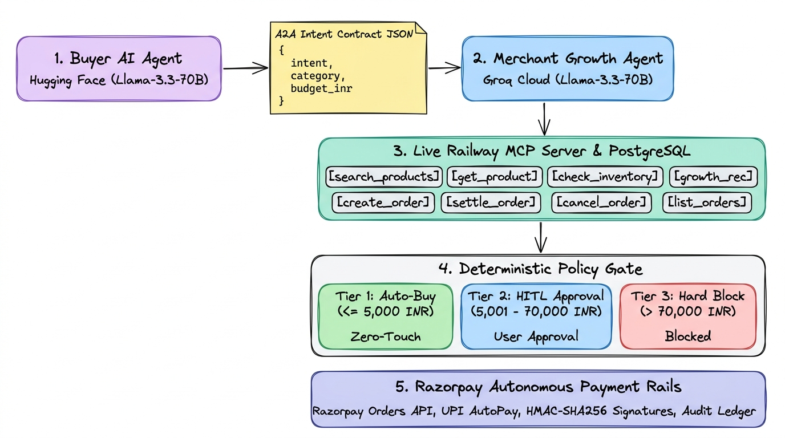

# 🚀 Agentic Commerce — AI Merchant Growth Agent & A2A Platform (MCP Architecture)

[](https://nextjs.org/)
[](https://www.typescriptlang.org/)
[](https://groq.com/)
[](https://huggingface.co/)
[](https://modelcontextprotocol.io/)
[](https://razorpay.com/)
[](https://www.prisma.io/)
[](https://railway.app/)

> ⚠️ **CRITICAL SAFETY NOTICE: THIS PLATFORM OPERATES EXCLUSIVELY IN RAZORPAY TEST MODE.**  
> No real currency is transferred, no real credit/debit card numbers are stored or processed, and production credentials must never be configured.

---

## 📖 Table of Contents
- [🌟 Executive Summary](#-executive-summary)
- [🏛️ End-to-End System Architecture](#️-end-to-end-system-architecture)
- [🤖 Dual-LLM Architecture: Hugging Face + Groq](#-dual-llm-architecture-hugging-face--groq)
- [🛡️ Deterministic 3-Tier Policy Gate Engine](#️-deterministic-3-tier-policy-gate-engine)
- [🛠️ The 8 Model Context Protocol (MCP) Tools](#️-the-8-model-context-protocol-mcp-tools)
- [💬 Interactive AI Buyer Chatbot Workflow](#-interactive-ai-buyer-chatbot-workflow)
- [💳 Razorpay Test Mode Booking & Settlement Cycle](#-razorpay-test-mode-booking--settlement-cycle)
- [🎬 Copy-Paste Demo Scenarios & Step-by-Step Test Guide](#-copy-paste-demo-scenarios--step-by-step-test-guide)
- [🔒 Security, Reliability & Compliance](#-security-reliability--compliance)
- [📁 Repository Structure & Directory Map](#-repository-structure--directory-map)
- [⚙️ Environment Variables & Configuration](#️-environment-variables--configuration)
- [🚀 Quickstart & Local Setup Guide](#-quickstart--local-setup-guide)
- [📜 Project Details & License](#-project-details--license)

---

## 🌟 Executive Summary

**Agentic Commerce** is a production-grade **Agent-to-Agent (A2A)** commerce ecosystem built on Anthropic's **Model Context Protocol (MCP)** and **Razorpay Test Mode**. 

As autonomous AI agents evolve from conversational assistants into economic actors capable of procuring goods on behalf of consumers, traditional e-commerce architectures face a critical bottleneck:
- Web storefronts are designed for human eyeballs (HTML rendering, banner ads, CAPTCHAs, manual checkout funnels).
- When AI buyers attempt to purchase online, they are blocked by bot protections, hallucinate uncataloged products, or face security vulnerabilities with unrestricted payment authorizations.

**Agentic Commerce solves this challenge end-to-end** by introducing:
1. **Interactive AI Buyer Chatbot**: Converts human conversational queries into deterministic, machine-readable A2A Commerce JSON contracts via **Hugging Face (`meta-llama/Llama-3.3-70B-Instruct`)**.
2. **Merchant AI Growth Agent (MCP Client)**: Powered by ultra-low-latency **Groq (`llama-3.3-70b-versatile`)**, autonomously querying the live store catalog, ranking products with token relevance scoring, and proposing intelligent growth upsells.
3. **Live Standalone MCP Server & Storefront**: Built with `@modelcontextprotocol/sdk` and Prisma ORM, deployed live on Railway with a PostgreSQL database, exposing 8 standardized tools.
4. **Deterministic 3-Tier Policy Gate**: Real-time programmatic guardrails governing whether transactions are **auto-executed (zero-touch)**, **paused for human authorization**, or **hard-blocked**.
5. **Autonomous Razorpay Order Creation & Settlement**: Automates the entire procurement and settlement cycle with real-time audit ledger logging.

---

## 🏛️ End-to-End System Architecture

<p align="center">
  
</p>

### 🔄 Multi-Stage Autonomous Execution Pipeline

| Stage | Component | Tech Stack | Role & Functionality |
| :--- | :--- | :--- | :--- |
| **1. Buyer Intent** | **Human Buyer & Chat** | Next.js 14, TailwindCSS | User inputs shopping requests naturally or clicks pre-built query chips in real-time. |
| **2. Intent Parser** | **Buyer AI Agent** | Hugging Face (`Llama-3.3-70B`) | Parses free-form natural language into a deterministic **A2A JSON Contract** (`category`, `budget_inr`, `preferences`). |
| **3. Growth Engine** | **Merchant Growth Agent** | Groq (`llama-3.3-70b-versatile`) | Acts as autonomous MCP Client: queries catalog, scores relevance, and computes intelligent growth upsells. |
| **4. Live Catalog** | **Standalone MCP Server** | Model Context Protocol SDK, Prisma, PostgreSQL | Live on Railway (`up.railway.app`), exposing 8 standardized tools (`search_products`, `get_product`, `create_order`). |
| **5. Policy Gate** | **3-Tier Policy Engine** | Programmatic Guardrails | **Tier 1**: Auto-Buy (Zero-Touch) \| **Tier 2**: HITL User Approval \| **Tier 3**: Hard Budget Violations. |
| **6. Settlement** | **Autonomous Payment Rails** | Razorpay Orders API, UPI AutoPay, HMAC-SHA256 | Issues authentic Razorpay test orders, cryptographic settlement proofs, and records immutable audit ledger logs. |

<details>
<summary><b>🔍 Click to view Detailed ASCII Flow Schematic</b></summary>

```
                              USER / HUMAN BUYER
                   (Types prompt in chat or clicks quick chip)
                                       │
                                       ▼
                   ┌───────────────────────────────────────┐
                   │        1. AI BUYER CHATBOT            │
                   │   meta-llama/Llama-3.3-70B-Instruct   │
                   │        (Hugging Face Router)          │
                   └───────────────────┬───────────────────┘
                                       │
                                       ▼
                        A2A Structured Intent Contract
                 { category, budget_inr, preferences, intent }
                                       │
                                       ▼
                   ┌───────────────────────────────────────┐
                   │    2. MERCHANT AI GROWTH AGENT        │
                   │       llama-3.3-70b-versatile         │
                   │         (Groq MCP Client)             │
                   └───────────────────┬───────────────────┘
                                       │
           ┌───────────────────────────┴───────────────────────────┐
           ▼                                                       ▼
   MCP Tool: search_products                               MCP Tool: get_product
(Keyword match & token relevance)                       (Live specs & real stock count)
           │                                                       │
           └───────────────────────────┬───────────────────────────┘
                                       │ Streamable MCP Protocol
                                       ▼
                   ┌───────────────────────────────────────┐
                   │    3. STANDALONE MCP SERVER (Node)    │
                   │  Live on Railway + PostgreSQL DB      │
                   │  https://ai-growth-agentic-commerce... │
                   └───────────────────┬───────────────────┘
                                       │
                                       ▼
                    ┌───────────────────────────────────────┐
                    │   4. DYNAMIC POLICY GATE EVALUATION   │
                    │   Server-side Deterministic Engine    │
                    │   + Cumulative Velocity SafeGuard     │
                    └───────────────────┬───────────────────┘
                                        │
        ┌───────────────────────────────┼───────────────────────────────┐
        │                               │                               │
        ▼                               ▼                               ▼
  TIER 1: AUTO-BUY            TIER 2: HITL APPROVAL            TIER 3: HARD BLOCK
Total <= Approval Threshold    Total > Threshold & <= Limit     Total > Maximum Limit
(e.g. ₹800 <= ₹5,000)          (e.g. ₹65,000 > ₹5,000)          (e.g. ₹77,000 > ₹70,000)
       ▼                               ▼                               ▼
 ⚡ ZERO-TOUCH CLEARANCE       🔒 HITL CLEARANCE               🛑 POLICY VIOLATION
• Sub-threshold clearance    • User click / "approve" in chat • 0 Razorpay API calls
• Emits spend mandate token  • Unlocks payment rail           • 0 MCP payment calls
       │                               │                               │
       └───────────────────────┬───────┘                               ▼
                               │                                Blocked Alert Box
                               ▼
        ┌────────────────────────────────────────────────────────┐
        │   5. AGENTIC PAYMENT AUTHORIZATION & PAYMENT RAILS     │
        │   • Razorpay Orders API: order_TXw6PIVNUZYcfo (INR)    │
        │   • Payment Rails: UPI AutoPay / e-Mandate / Tokenized │
        │   • Idempotency Nonce: idemp_order_4_session_...       │
        │   • HMAC-SHA256 Cryptographic Settlement Signature    │
        └──────────────────────────┬─────────────────────────────┘
                                   │
                                   ▼
        ┌────────────────────────────────────────────────────────┐
        │   6. UAP-STYLE SETTLEMENT RECEIPT (BACK TO AI BUYER)   │
        │   Store Booking ID + Razorpay ID + Settlement Proof    │
        └────────────────────────────────────────────────────────┘
```
</details>

---

## 🤖 Dual-LLM Architecture: Hugging Face + Groq

To eliminate vendor lock-in, optimize inference costs, and guarantee strict separation of concerns between **Buyer Intent Understanding** and **Merchant Action Execution**, this platform implements a specialized **Dual-LLM Architecture**:

```
 ┌────────────────────────────────────────┐       ┌────────────────────────────────────────┐
 │            BUYER-SIDE AGENT            │       │           MERCHANT-SIDE AGENT          │
 │                                        │       │                                        │
 │ Model: meta-llama/Llama-3.3-70B        │       │ Model: llama-3.3-70b-versatile         │
 │ Provider: Hugging Face Serverless      │       │ Provider: Groq Cloud                   │
 │ Purpose: Question Curation & Contract  │       │ Purpose: MCP Client & Tool Execution   │
 └───────────────────┬────────────────────┘       └───────────────────▲────────────────────┘
                     │                                                │
                     │ Structured A2A Intent Contract (JSON)          │
                     └────────────────────────────────────────────────┘
```

### 1. Buyer-Side LLM: Hugging Face (`meta-llama/Llama-3.3-70B-Instruct`)
- **Location**: `frontend/src/app/api/agent/curate/route.ts` & `frontend/src/app/api/agent/chat/route.ts`
- **Role**: Natural language understanding, intent extraction, question curation, and schema serialization.
- **Why Hugging Face?**: Provides open-weights LLaMA 3.3 70B inference via the standard OpenAI-compatible Serverless Router (`https://router.huggingface.co/v1`), ensuring conversational flexibility without hallucinating merchant business logic.
- **Input**: Human prompt (e.g. `"StrikePad Gaming Mouse Pad XL order this"` or `"I need a fast laptop for video editing under ₹70,000"`).
- **Output**: Machine-readable A2A Commerce JSON contract:
  ```json
  {
    "buyer_id": "demo-ai-buyer",
    "intent": "purchase_mouse_pad",
    "category": "StrikePad Gaming Mouse Pad XL",
    "budget_inr": 70000,
    "preferences": {
      "use_case": "gaming",
      "priority": "performance"
    }
  }
  ```

### 2. Merchant-Side LLM: Groq (`llama-3.3-70b-versatile`)
- **Location**: `frontend/src/app/api/agent/chat/route.ts`
- **Role**: High-speed MCP Client agent, catalog scoring, growth upsell generation, and policy-guarded checkout execution.
- **Why Groq?**: Blazing inference speeds (sub-300ms time-to-first-token). Agent-to-Agent commerce requires near-instantaneous tool evaluation and catalog searching.
- **Execution**: Takes the curated A2A JSON contract, executes MCP tools (`search_products`, `get_product`), computes relevance weights across product titles, specs, and prices, and generates high-value, contextual upsell suggestions.

---

## 🛡️ Deterministic 3-Tier Policy Gate Engine

LLMs can be tricked by prompt injection, jailbreaks, or hallucinations. Therefore, **payment authorization is NEVER entrusted to LLM judgment**.

All financial policy decisions are enforced by a **deterministic, server-side rule engine** located in `frontend/src/app/api/policies/check/route.ts` and dynamically configured in `/policy`:

| Policy Tier | Mathematical Condition | Real-World Example | Agent Behavior |
| :--- | :--- | :--- | :--- |
| **Tier 1: Autonomous Zero-Touch** | $\text{Total} \le \text{Approval Threshold}$ | StrikePad Mouse Pad (₹800) $\le$ ₹5,000 Threshold | **Direct Auto-Order**: Order is booked and settled immediately on the live store via MCP without asking permission. Zero confirmation buttons shown. |
| **Tier 2: Human Authorization Required** | $\text{Approval Threshold} < \text{Total} \le \text{Max Limit}$ | NovaBook Pro 14 (₹65,000) $>$ ₹5,000 Threshold | **Pause & Ask**: Pauses execution at the Policy Gate. Shows `[ Approve & Place Order on Website (Pay ₹65,000) ]` and `[ Reject / Cancel Order ]`. Also accepts `"approve"` in chat. |
| **Tier 3: Hard Policy Violation Block** | $\text{Total} > \text{Maximum Transaction Limit}$ | Workstation + 4K Monitor (₹77,000) $>$ ₹70,000 Limit | **Hard Block**: Refuses transaction immediately. **Zero (0) Razorpay API calls and zero (0) MCP payment calls**. Violation logged in audit ledger. |

### Dynamic Merchant Policy Controls (`/policy`)
Merchants can adjust these parameters in real time with immediate cross-application synchronization:
- **Approval Threshold (₹)**: Purchases below this amount require zero human intervention (e.g., default: ₹5,000).
- **Maximum Transaction Limit (₹)**: Hard ceiling above which no transaction can proceed (e.g., default: ₹70,000).
- **Velocity Limits**: Maximum transactions allowed per hour (default: 5).
- **Category Whitelist / Blacklist**: Programmatically restrict agent purchasing in sensitive categories (e.g. Gift Cards, Crypto).

---

## 🛠️ The 8 Model Context Protocol (MCP) Tools

The standalone MCP Server (`ecommerce-mcp/mcp-server/server.ts`) implements the official `@modelcontextprotocol/sdk` standard. It exposes 8 standardized tools backed by PostgreSQL and Prisma ORM:

| # | Tool Name | Parameters | Description |
| :-: | :--- | :--- | :--- |
| **1** | `search_products` | `query: string` | Semantic and keyword catalog search across product title, category, and description. |
| **2** | `get_product` | `product_id: string` | Retrieves complete product specifications, real-time price in paise, and stock count. |
| **3** | `get_products_by_category` | `category: string` | Returns all catalog items belonging to a category or category slug. |
| **4** | `check_inventory` | `product_id: string` | Real-time atomic inventory verification prior to order placement. |
| **5** | `create_order` | `customer_email: string`, `items: array` | Atomically reserves stock, creates a database order record, and generates a Razorpay Test Order. |
| **6** | `verify_payment_policy` | `amount_inr: number`, `category: string` | Evaluates whether a proposed order complies with merchant velocity and threshold limits. |
| **7** | `settle_order` | `order_id: string`, `payment_id: string` | Autonomous agent settlement tool. Marks database order as `PAID` with agent transaction token. |
| **8** | `get_order_status` | `order_id: string` | Queries fulfillment status (`PENDING`, `PAID`, `CANCELLED`) and tracking details. |

---

## 💬 Interactive AI Buyer Chatbot Workflow

The AI Buyer column at [http://localhost:3000/demo](http://localhost:3000/demo) is a real-time, interactive commerce chatbot where users can speak naturally, and the dual-agent architecture orchestrates the required actions via live MCP tools:

### Supported Conversational Commands & MCP Tool Mapping:
| User Command Example | Hugging Face Role (Curation) | Groq Merchant Agent Role (MCP Client) | Live MCP Tool Executed | Live Result Displayed |
| :--- | :--- | :--- | :--- | :--- |
| **`"i want a mouse"`** *(Generic Query)* | Curates generic query `"mouse"`, category `Peripherals` | Searches live catalog, finds multiple matching options (AeroMouse X1, AeroMouse X2, ComfortGrip Ergo Mouse) | `search_products`, `get_product` | **Recommends options based on query** with interactive **`[ ⚡ Select & Order ]`** cards. When clicked, proceeds directly to checkout! |
| **`"StrikePad Gaming Mouse Pad XL order this"`** *(Exact Product)* | Curates exact product name | Identifies exact product match immediately, bypassing selection | `search_products`, `create_order`, `settle_order` | **Direct Order**: Price ₹800 $\le$ ₹5,000 threshold $\rightarrow$ auto-booked on live Railway store via MCP with zero human clicks! |
| **`"order NovaBook Pro 14"`** *(Exact Product)* | Curates exact product name, budget ₹70k | Identifies exact match (₹65,000), evaluates policy $>$ ₹5,000 threshold | `search_products`, `get_product` | **Direct Order**: Pauses at Policy Gate for human authorization. Renders `[ Approve & Place Order on Website ]` in Transaction box. |
| **`"what are my orders"`** or `📦 what are my orders` | Curates action `LIST_ORDERS` | Retrieves recent orders from live store and formats with statuses and prices | `get_customer_orders` / `GET /api/orders` | Displays live store orders list with `✅ PAID`, `⏳ PENDING`, and `❌ CANCELLED` badges directly in chat. |
| **`"cancel this order"`** or `🛑 cancel this order` | Curates action `CANCEL_ORDER` and targets active order ID | Invokes cancellation on Railway store platform | `cancel_order` / `DELETE /api/orders/:id` | Cancels the order in PostgreSQL DB, restores reserved stock to catalog, and confirms cancellation in chat. |
| **`"what is my spending limit"`** | Curates action `POLICY_INQUIRY` | Explains current merchant spending rules | Server-side policy rules engine | Outlines autonomous threshold (₹5,000) and max limit (₹70,000) in conversational format. |

### Interactive Chat Experience Features:
1. **Always-Active Chat Bar**: Fixed at the bottom of the AI Buyer card. Type any query or command at any point and press **Enter** or click **Send**. The text input automatically resets upon sending.
2. **Auto-Scrolling Chat Feed**: Smoothly scrolls via `chatEndRef` to keep the newest agent thoughts, contracts, and recommendations in view.
3. **Natural Decision Handling**:
   - For upsells: respond `"yes"`, `"add"`, `"skip"`, or `"no"` directly in the chat.
   - For human authorization: respond `"approve"`, `"pay"`, `"reject"`, or `"cancel"` directly in the chat.
4. **Instant Action Chips**: One-click quick prompts at the bottom of the chat for immediate testing without typing.

---

## 💳 Razorpay Test Mode Booking & Settlement Cycle

Every order placed by the agent follows the official Razorpay payment lifecycle:

1. **Order Creation (`POST /api/orders/create`)**:
   - The MCP client sends the finalized basket to the store API.
   - The server verifies inventory, locks stock, calculates line totals in paise (`amount = inr * 100`), and creates a Razorpay Test Order (`order_...`).
   - The database record is stored with status `PENDING`.
2. **Autonomous Agent Settlement (`POST /api/orders/settle`)**:
   - For authorized orders, the agent invokes settlement on the live store with a cryptographically traceable settlement ID (`pay_agent_mcp_...`).
   - The server marks the order status as `PAID`, logs the payment reference, and decrements catalog inventory.
3. **Cryptographic Signature Verification**:
   - For webhooks and callbacks, HMAC SHA-256 signatures are verified using `RAZORPAY_KEY_SECRET`:
     ```ts
     const expectedSignature = crypto
       .createHmac('sha256', process.env.RAZORPAY_KEY_SECRET!)
       .update(`${razorpay_order_id}|${razorpay_payment_id}`)
       .digest('hex');
     ```
4. **Audit Logging**:
   - Every state transition is written to the immutable transaction ledger with timestamp, agent ID, policy decision, and Razorpay reference.

---

## 📱 Anti-Runaway AI Velocity Controls & Mobile Push SafeGuard

A primary enterprise and regulatory concern with autonomous AI commerce agents is the **"Runaway Agent Problem"** (e.g., an agent executing dozens of small ₹500–₹2,000 transactions without human oversight, collectively draining an account). 

To solve this, our platform enforces a **Cumulative Financial Velocity Guardrail**:

1. **Rolling Monthly Spend Cap (Default: ₹50,000)**:
   - Aggregates historical settled transactions (`cumulativeSpent`) in `CommerceContext` and PostgreSQL.
   - Configurable live via the [Policy Settings Page](http://localhost:3000/policy).
2. **SafeGuard Interceptor**:
   - Before executing any transaction (even if it is $\le$ ₹5,000 and normally qualifies for zero-touch auto-buy), the Policy Gate computes:
     $$\text{Projected Spend} = \text{Cumulative Spent} + \text{Current Order Amount}$$
   - If $\text{Projected Spend} > \text{Monthly Budget Limit}$, autonomous auto-buy is **immediately suspended**.
   - The transaction is escalated to **Human Authorization Required**.
3. **Simulated Smartphone Push Notification Banner**:
   - A floating, iOS/Android-styled push notification slides down from the top right:
     > **📱 Razorpay SafeGuard • Just Now**  
     > ⚠️ **Cumulative Budget Limit Exceeded**  
     > *This purchase of ₹X pushes your monthly spending to ₹Y, crossing your set limit of ₹50,000! Autonomous buying suspended.*
   - Includes real-time velocity progress bars, an **[ Authorize ]** button to override, and instant feedback.
4. **Audit Trail Logging**:
   - Velocity breaches and SafeGuard alerts are logged to the immutable compliance ledger for auditing.

---

## 🎬 Copy-Paste Demo Scenarios & Step-by-Step Test Guide

### Scenario 1: Autonomous Auto-Buy Under Threshold ($\le$ ₹5,000)
*Demonstrates zero-touch agentic purchasing without human friction.*

1. Navigate to [http://localhost:3000/demo](http://localhost:3000/demo).
2. Click the quick chip: **`⚡ StrikePad Gaming Mouse Pad XL order this`**  
   *(or type `StrikePad Gaming Mouse Pad XL order this` into the chat and press Enter)*.
3. **What Happens**:
   - **Hugging Face** parses intent and curates the A2A contract for `StrikePad Gaming Mouse Pad XL` (₹800).
   - **Groq** matches the exact item in the live catalog via `search_products`.
   - **Policy Gate** evaluates: ₹800 $\le$ ₹5,000 Approval Threshold $\rightarrow$ **`AUTO-BUY (Zero-Touch)`**.
   - **The agent directly books and settles the order on the live website via MCP without asking for permission**.
4. **Result**:
   - The Transaction box immediately renders the dark green receipt:
     - `✓ Booked on Live Website (via MCP)`
     - Status: `PAID`
     - Live Store Booking ID (e.g., `cmtms...`), Razorpay Order ID, and Settlement ID.

---

### Scenario 2: Human Authorization Required ($>$ ₹5,000)
*Demonstrates programmatic financial guardrails pausing high-value orders.*

1. Navigate to [http://localhost:3000/demo](http://localhost:3000/demo).
2. Click the quick chip: **`🔒 NovaBook Pro 14 order this`**  
   *(or type `I need a laptop for work under ₹70,000` into the chat and press Enter)*.
3. **What Happens**:
   - **Hugging Face** curates the intent contract for a high-performance laptop.
   - **Groq** retrieves `NovaBook Pro 14` (₹65,000) from the live store catalog.
   - **Policy Gate** evaluates: ₹65,000 $>$ ₹5,000 Approval Threshold $\rightarrow$ **`POLICY GATE: HUMAN APPROVAL REQUIRED`**.
   - Execution pauses safely at the gate.
4. **Result**:
   - The Policy Gate badge shows `APPROVAL NEEDED`.
   - The Transaction box displays:
     - `[ Approve & Place Order on Website (Pay ₹65,000) ]`
     - `[ Reject / Cancel Order ]`
5. **Completion**:
   - Click `Approve & Place Order on Website` (or type `"approve"` in chat).
   - The agent invokes MCP `create_order` + `settle_order` on Railway, marking the order `PAID` and displaying the green receipt.

---

### Scenario 3: Hard Policy Limit Block ($>$ ₹70,000)
*Demonstrates fail-closed protection against out-of-policy spending.*

1. In the top navigation bar, click **Run Blocked Scenario**.
2. **What Happens**:
   - The basket contains `Workstation Laptop` (₹65,000) + `UltraView 4K Monitor` (₹12,000) = **₹77,000**.
   - **Policy Gate** evaluates: ₹77,000 $>$ ₹70,000 Maximum Transaction Limit $\rightarrow$ **`HARD POLICY BLOCK`**.
3. **Result**:
   - Transaction is immediately blocked with an alert.
   - **Exactly 0 Razorpay API calls and 0 MCP payment calls are executed**.
   - Refusal is logged in the Audit Trail (`/transactions`).

---

### Scenario 4: Dynamic Policy Adjustment
*Demonstrates live re-configuration of merchant thresholds.*

1. Navigate to [http://localhost:3000/policy](http://localhost:3000/policy).
2. Lower the **Approval Threshold (₹)** from `5000` to `1000`, and click **Save Policy Settings**.
3. Return to `/demo` and enter: `"i want a HubConnect Pro USB Hub"` (₹2,500).
4. **Result**:
   - Previously, ₹2,500 was auto-approved under ₹5,000.
   - Now, because ₹2,500 $>$ ₹1,000, the Policy Gate automatically pauses and requests human authorization!

---

### Scenario 5: Cumulative Spend Velocity Breach & Mobile SafeGuard Alert
*Demonstrates prevention of the runaway AI spending loop and real-time mobile push alert.*

1. Navigate to [http://localhost:3000/demo](http://localhost:3000/demo).
2. Observe the **Monthly Budget SafeGuard** card in the right column (`Spent: ₹0 / ₹50,000`).
3. To test the breach easily:
   - Navigate to [http://localhost:3000/policy](http://localhost:3000/policy) and set the **Cumulative Monthly Budget** to `1000` (or buy multiple items to exceed ₹50,000).
   - Click **Save & Update Policy Rules**.
4. Return to `/demo` and enter: `"StrikePad Gaming Mouse Pad XL order this"` (₹800).
   - If previous spend + ₹800 exceeds ₹1,000:
5. **What Happens**:
   - The **Mobile Push Notification banner** vibrates and slides down from the top right:
     `⚠️ Cumulative Budget Limit Exceeded: Adding ₹800 crosses your set limit!`
   - The Policy Gate displays: `📱 Mobile Push Notification Dispatched — Human Authorization Required`.
   - Autonomous zero-touch buying is paused despite the item being under ₹5,000.
6. **Resolution**:
   - Click **Authorize** directly on the mobile notification banner (or click **Approve & Place Order on Website** in the Transaction box).
   - Order is authorized and booked on live Railway PostgreSQL with an immutable audit record!

---

## 🔒 Security, Reliability & Compliance

1. **Deterministic Financial Guardrails**: All policy decisions run server-side in TypeScript/FastAPI. LLM prompts cannot override threshold ceilings or category restrictions.
2. **Database as Single Source of Truth**: Live products, prices, and stock exist in PostgreSQL via Prisma ORM. Agents cannot hallucinate uncataloged items or alter pricing.
3. **Fail-Closed Architecture**: If an API error, network timeout, or schema mismatch occurs, transactions fail closed with 0 payment calls.
4. **Server-Side Price Computation**: All calculations are executed server-side in paise (`price_inr * 100`). Client-supplied pricing is discarded.
5. **HMAC SHA-256 Signature Verification**: Every Razorpay callback is cryptographically verified server-side using `RAZORPAY_KEY_SECRET`.
6. **Secret Isolation**: Private API keys (`GROQ_API_KEY`, `HUGGINGFACE_API_TOKEN`, `RAZORPAY_KEY_SECRET`) remain on the server and are never exposed to client browsers.
7. **Immutable Audit Trail**: Every A2A session, policy check, and payment attempt is logged to the PostgreSQL audit ledger for auditability.

---

## 📁 Repository Structure & Directory Map

```
AI-Growth-Agentic-Commerce/
├── ecommerce-mcp/                      # Live MCP Server + Storefront (Railway Deployment)
│   ├── mcp-server/
│   │   └── server.ts                   # Standalone Model Context Protocol (MCP) server
│   ├── prisma/
│   │   └── schema.prisma               # PostgreSQL models (Product, Order, OrderItem)
│   ├── app/
│   │   ├── api/products/route.ts       # Live catalog search API
│   │   ├── api/orders/create/route.ts  # Database order & Razorpay order creation
│   │   ├── api/orders/settle/route.ts  # Autonomous agent settlement API
│   │   └── api/webhooks/razorpay/      # HMAC-verified Razorpay webhook listener
│   └── lib/
│       ├── db.ts                       # Prisma client connection
│       └── products.ts                 # Catalog helper utilities
│
├── frontend/                           # Next.js 15 App Router Frontend & MCP Client
│   ├── src/app/
│   │   ├── demo/page.tsx               # 4-column Interactive A2A Demo & Chatbot
│   │   ├── policy/page.tsx             # Dynamic Policy Gate configuration dashboard
│   │   ├── transactions/page.tsx       # Real-time transaction audit ledger
│   │   ├── architecture/page.tsx       # System architecture interactive diagram
│   │   ├── scenarios/page.tsx          # Automated failure scenario test harness
│   │   └── api/
│   │       ├── agent/curate/route.ts   # Hugging Face LLaMA 3.3 70B Question Curation
│   │       ├── agent/chat/route.ts     # Groq LLaMA 3.3 70B MCP Client Agent
│   │       ├── policies/check/route.ts # Deterministic 3-Tier Policy Gate Engine
│   │       └── orders/                 # Proxies for live store order creation & settlement
│   ├── src/context/
│   │   └── CommerceContext.tsx         # Cross-application policy limits state synchronizer
│   └── src/lib/
│       └── mock-data/                  # Fallback datasets and initial policy defaults
│
├── backend/                            # FastAPI Python Backend (Alternative / Microservice)
│   ├── app/models/                     # SQLAlchemy ORM models
│   ├── app/services/                   # PaymentService, PolicyService, CatalogService
│   └── app/main.py                     # FastAPI application entrypoint
│
├── agent/                              # Python LangGraph Agent (Alternative / Microservice)
│   ├── app/graph/                      # LangGraph StateGraph nodes and workflows
│   ├── app/tools/                      # Python MCP tool implementations
│   └── .env                            # Python environment configuration
│
└── README.md                           # Comprehensive project documentation
```

---

## ⚙️ Environment Variables & Configuration

Create or update `.env` in `frontend/` and `agent/`:

### Frontend Configuration (`frontend/.env.local` or `frontend/.env`)
```bash
# Live Railway Storefront & MCP Server
NEXT_PUBLIC_STORE_URL=https://ai-growth-agentic-commerce-production.up.railway.app
STORE_API_URL=https://ai-growth-agentic-commerce-production.up.railway.app

# Internal API Base Routes
NEXT_PUBLIC_API_URL=/api
NEXT_PUBLIC_AGENT_URL=/api

# Groq Cloud API Key (for Merchant MCP Client Agent)
GROQ_API_KEY=gsk_...

# Hugging Face API Token (for Buyer Question Curation)
HUGGINGFACE_API_TOKEN=hf_...

# Razorpay Test Mode Credentials
RAZORPAY_KEY_ID=rzp_test_...
RAZORPAY_KEY_SECRET=...
```

---

## 🚀 Quickstart & Local Setup Guide

### Prerequisites
- **Python**: 3.10+ / 3.11+
- **Node.js**: v18+ / v20+
- **npm** or **pnpm**
- **Git**

### Step 1: Clone the Repository
```bash
git clone https://github.com/GunaTeja777/AI-Growth-Agentic-Commerce.git
cd AI-Growth-Agentic-Commerce
```

### Step 2: Set Up Python Virtual Environment (Backend & Agent)
```bash
# Create virtual environment
python -m venv .venv

# Activate virtual environment:
# Windows (PowerShell):
.\.venv\Scripts\Activate.ps1
# Linux / macOS:
source .venv/bin/activate

# Install dependencies
pip install -r backend/requirements.txt
pip install -r agent/requirements.txt
```

### Step 3: Install Frontend Dependencies
```bash
cd frontend
npm install
cd ..
```

### Step 4: Configure Environment Variables
Ensure `frontend/.env.local` contains your API keys:
```bash
GROQ_API_KEY=gsk_...
HUGGINGFACE_API_TOKEN=hf_...
```

### Step 5: Run the Services (3 Terminals)

Open 3 terminal windows in the project root:

#### 🖥️ Terminal 1 — Backend (FastAPI & Policy Audit — Port 8000)
```bash
# Windows (PowerShell):
$env:PYTHONPATH="backend"
uvicorn app.main:app --host 0.0.0.0 --port 8000 --reload

# Linux / macOS:
PYTHONPATH=backend uvicorn app.main:app --host 0.0.0.0 --port 8000 --reload
```

#### 🤖 Terminal 2 — Agent Orchestrator (LangGraph & MCP Client — Port 8001)
```bash
# Windows (PowerShell):
$env:PYTHONPATH="agent"
uvicorn app.main:app --host 0.0.0.0 --port 8001 --reload

# Linux / macOS:
PYTHONPATH=agent uvicorn app.main:app --host 0.0.0.0 --port 8001 --reload
```

#### 🌐 Terminal 3 — Frontend (Next.js Application — Port 3000)
```bash
cd frontend
npm run dev
```

---

### 🛍️ Live E-Commerce Store & MCP Server
The full product catalog and PostgreSQL database are already deployed and hosted live on Railway:
- **Live E-Commerce Storefront**: [https://ai-growth-agentic-commerce-production.up.railway.app](https://ai-growth-agentic-commerce-production.up.railway.app)

*(The backend, agent orchestrator, and frontend are pre-configured to communicate directly with this live store instance out of the box).*

---

## 📜 Project Details & License

- **Project**: Agentic Commerce — AI Merchant Growth Agent & A2A Platform
- **Core Architecture**: Agent-to-Agent (A2A) Protocols, Model Context Protocol (MCP), UAP-Style Intent Contract
- **Core Technologies**: Model Context Protocol (MCP), Groq LLaMA 3.3 70B, Hugging Face LLaMA 3.3 70B, Next.js 15, PostgreSQL, Prisma ORM, Razorpay Test Mode.
- **License**: MIT License. Open source and free for commercial or experimental use.
