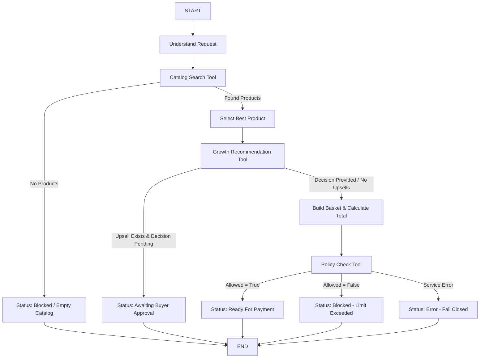

# 🤖 Agentic Commerce — AI Merchant Growth Agent (Phase 3)

The **AI Merchant Growth Agent** orchestrates autonomous product discovery, data-backed cross-sells/upsells, human-in-the-loop buyer approval gating, and deterministic policy enforcement using **LangGraph** and modular **LangChain Tools**.

---

## 🏛️ Architecture & System Boundary

```
                     ┌──────────────────┐
                     │     AI Buyer     │
                     └─────────┬────────┘
                               │ POST /agent/chat or CLI
                               ▼
               ┌───────────────────────────────┐
               │   Merchant AI Growth Agent    │
               │    (LangGraph Orchestrator)   │
               └───────────────┬───────────────┘
                               │
            ┌──────────────────┼──────────────────┐
            ▼                  ▼                  ▼
     ┌─────────────┐    ┌─────────────┐    ┌─────────────┐
     │Catalog Tool │    │ Growth Tool │    │ Policy Tool │
     └──────┬──────┘    └──────┬──────┘    └──────┬──────┘
            │                  │                  │
            └──────────────────┼──────────────────┘
                               │ HTTP REST calls
                               ▼
                  ┌─────────────────────────┐
                  │  FastAPI Backend (8000) │
                  └────────────┬────────────┘
                               │
                               ▼
                  ┌─────────────────────────┐
                  │   PostgreSQL Database   │
                  └─────────────────────────┘
```

### 🔒 Key Design Principles & Separation of Concerns

| Component | Responsibility | Principle |
|---|---|---|
| **AI Agent** | *"What should I do next?"* | Discovers products, proposes growth items, structures cart. |
| **Policy Engine** | *"Is this transaction allowed?"* | **Authoritative & Deterministic**. The LLM can **never** override policy decisions. |

1. **Zero Database Access**: The agent **never** accesses PostgreSQL directly. All state queries go through FastAPI HTTP endpoints.
2. **Zero Fake Recommendations**: Growth recommendations are retrieved from backend relationship graphs; the LLM never fabricates upsells or reasons.
3. **Buyer Approval Gating**: Optional growth recommendations are never automatically charged without explicit buyer confirmation.
4. **Fail-Closed Policy Security**: If the Policy API is unreachable or returns an error, the agent strictly stops and will not proceed to payment.
5. **No Autonomous Payment in Phase 3**: Payment tools and Razorpay execution are strictly withheld until Phase 4.

---

## 📁 Project Structure

```
agent/
├── app/
│   ├── __init__.py
│   ├── main.py                     # CLI Interactive Demo & FastAPI /agent/chat server
│   │
│   ├── config.py                   # Pydantic Settings & environment config
│   │
│   ├── graph/
│   │   ├── __init__.py
│   │   ├── state.py                # Strongly typed LangGraph AgentState
│   │   ├── nodes.py                # Graph nodes (Search, Recommend, Gating, Policy)
│   │   └── workflow.py             # LangGraph state machine & conditional routers
│   │
│   ├── tools/
│   │   ├── __init__.py             # LangChain tool registry
│   │   ├── catalog_tool.py         # Catalog search tool (calls /api/products)
│   │   ├── growth_tool.py          # Data-driven upsell tool (calls /api/growth/recommendations)
│   │   └── policy_tool.py          # Deterministic policy tool (calls /api/policies/check)
│   │
│   ├── services/
│   │   ├── __init__.py
│   │   └── backend_client.py       # Async HTTP client (httpx) with error handling
│   │
│   ├── schemas/
│   │   ├── __init__.py
│   │   └── agent_schemas.py        # Pydantic request/response models & AgentStatus enum
│   │
│   └── prompts/
│       ├── __init__.py
│       └── agent_prompt.py         # System prompt & intent extraction templates
│
├── tests/
│   ├── __init__.py
│   ├── test_tools.py               # Unit tests for Catalog, Growth, Policy tools
│   ├── test_workflow.py            # LangGraph workflow tests across all 4 core scenarios
│   └── test_agent_api.py           # FastAPI endpoint tests
│
├── .env.example                    # Environment variable template
├── requirements.txt                # Python dependencies
└── README.md                       # Comprehensive guide
```

---

## ⚙️ Installation & Setup

### 1. Prerequisites
- Python 3.11+
- Running FastAPI Backend (from `backend/` directory)

### 2. Install Dependencies
Using `pip` or `uv`:
```bash
# Using standard pip
pip install -r agent/requirements.txt

# Or using uv (recommended for ultra-fast installs)
uv pip install -r agent/requirements.txt
```

### 3. Configure Environment Variables
Copy `.env.example` to `.env` in the `agent/` folder:
```bash
cp agent/.env.example agent/.env
```

Edit `agent/.env`:
```env
# FastAPI Backend URL
BACKEND_URL=http://localhost:8000

# LLM Configuration (Optional - standard deterministic parser is used as fallback)
LLM_PROVIDER=openai
LLM_API_KEY=your_openai_api_key_here
LLM_MODEL=gpt-4o-mini

# Default Merchant
DEFAULT_MERCHANT_ID=1
```

---

## 🚀 Running the Services

### Step 1: Start the FastAPI Backend
Ensure the backend is running on `http://localhost:8000`:
```bash
cd backend
uvicorn app.main:app --host 0.0.0.0 --port 8000 --reload
```

### Step 2: Start the AI Merchant Growth Agent

#### Option A: Interactive CLI Demo (Testing without Frontend)
```bash
# From workspace root
$env:PYTHONPATH="agent"; python agent/app/main.py --cli
```

**Example CLI Interaction:**
```
=================================================================
 🤖 AGENTIC COMMERCE — AI MERCHANT GROWTH AGENT (CLI DEMO)
=================================================================
 Connected Backend: http://localhost:8000
 (Type 'exit' or 'quit' to stop)

[Buyer Prompt] > I need a laptop under 70000

🔄 Agent thinking and orchestrating tools...

[Agent Status]: AWAITING_BUYER_APPROVAL
[Message]:
I found the **NovaBook Pro 14** for ₹65,000.00.

💡 **Recommendation**: AeroMouse X1 is Frequently bought with NovaBook Pro 14 and costs ₹1,500.00.
Would you like to add it to your basket?

[Buyer Decision (Yes/No)] > Yes

🔄 Resuming workflow with decision: 'yes'...

[Agent Final Status]: READY_FOR_PAYMENT
[Message]:
Policy approved: Transaction is within allowed limit. Your basket [NovaBook Pro 14 (₹65,000.00), AeroMouse X1 (₹1,500.00)] with total ₹66,500.00 is ready for payment.

🛒 [Final Cart Items]:
  - NovaBook Pro 14: ₹65,000.00 x 1
  - AeroMouse X1 (Upsell): ₹1,500.00 x 1
  Total: ₹66,500.00

🛡️ [Policy Engine Result]: Allowed=True | Reason: Transaction is within the allowed limit
```

#### Option B: Standalone API Microservice
```bash
$env:PYTHONPATH="agent"; python -m uvicorn app.main:app --app-dir agent --port 8001 --reload
```
Exposes:
- `POST /agent/chat`: Full multi-turn orchestration endpoint
- `GET /health`: Healthcheck & backend status

---

## 🔄 LangGraph State & Workflow



---

## 🧪 Testing

The test suite covers 13 test cases across tools, multi-turn state machine transitions, human gating, and security boundaries.

Run pytest:
```bash
$env:PYTHONPATH="agent"; uv run pytest agent/tests -v
```

### Verified Test Scenarios:
1. **Scenario 1 (Success + Upsell Acceptance)**: Searches catalog, presents upsell, receives buyer approval ("yes"), verifies policy (`₹66,500 <= ₹70,000`), reaches `ready_for_payment`.
2. **Scenario 2 (Rejection of Upsell)**: Rejects upsell ("no"), verifies base cart (`₹65,000`), reaches `ready_for_payment`.
3. **Scenario 3 (Policy Limit Block)**: High amount (`₹75,000 > ₹70,000`), policy engine returns `allowed=false`, halts at `blocked`.
4. **Scenario 4 (Fail-Closed Service Failure)**: Simulates Policy API downtime (503/500), workflow safely stops in `error` state.
5. **No Hallucination**: Verifies no fake products or prices can be injected.

---

## 🛡️ Next Steps (Phase 4)
Phase 3 is complete. In **Phase 4**, we will connect:
`Policy ALLOWED` ➔ `Payment Tool` ➔ `Razorpay Test API` ➔ `Order Confirmation`.
